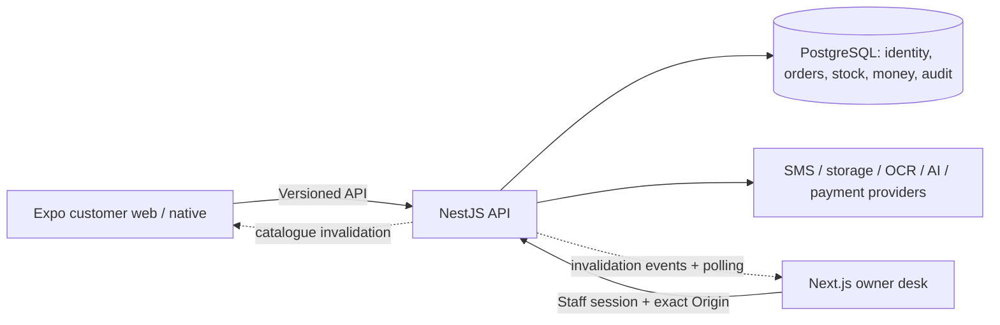

# Review handoff — 9 October 2026

This is a source-review release on `codex/pilot-readiness`, not approval for public staging or shop operation. Online payments remain disabled. Nothing in this release authorizes deployment, live data migration or customer messages. The proposed next product is described separately in [V2_INTEGRATION_ROADMAP.md](V2_INTEGRATION_ROADMAP.md).

## Baseline and change scope

Repository: <https://github.com/amankeshri7542/cement-order-app>. Existing draft: [PR #1](https://github.com/amankeshri7542/cement-order-app/pull/1). Starting HEAD was `8f0fc53568059a7cc10d844766f769b8f637b7e6`; a fresh fetch showed zero ahead/behind against the feature branch. No main merge, reset or rewritten history is part of this handoff. Use `git rev-parse HEAD` after checking out the review commit to identify the exact revision; CI must be checked for that SHA, not merely for the branch name.

The main application, migration, test and CI changes are committed as `5db35e3db9a3ac1763a1c5f0ae2bf197a5050a8f`. The release follow-up also corrects the catalogue interaction race described below.

The previously uncommitted work adds the simplified bilingual owner desk, durable owner work/acknowledgment, COD delivery exceptions and physical returns, dated cash movements, accepted-quote conversion, customer cart/draft/uncertain-submit recovery, and QA corrections. Security changes add transactional demand caps, audited exceptions, persistent resource budgets, validated photos, open-session event checks, frontend CSP and operational recovery tooling. Three additive migrations introduce the workflow/financial records, quote/order pack snapshots, and demand exceptions/validated asset records. Existing transactional stock, server prices, record ownership, signed payment events and human price approval remain in place.

This release review fixes clean-checkout CI setup: the bootstrap command explicitly loads `.env.test`, but the workflow previously created only `.env`. Its missing-file failure was reproduced (exit 9); CI now creates `.env.test` from its disposable test URL. CI then exposed a catalogue race: an unchanged search debounce cleared/remounted the product card during a click. Preserving equal normalized search state removes that unnecessary reload. A clock-controlled real pointer regression fails before the fix and passes after it; existing live-price refresh and explicit checkout review remain tested.

## Status vocabulary

- **Verified locally:** source inspected and the described behavior exercised locally; the evidence column limits the claim.
- **Implemented but unverified:** code exists, but the relevant real environment has not been exercised.
- **Partially implemented:** a useful subset works; the missing behavior is named.
- **Blocked:** verification or use requires an unresolved dependency, environment or decision.
- **Not implemented:** a proposal only, with no current product claim.

## Feature inventory

Paths below are relative to this repository. Browser evidence means real local NestJS/PostgreSQL with synthetic accounts. SMS, OCR/AI, storage and payment adapters are simulations where used; they are not live-provider certification.

| Capability / status | Customer or owner benefit | Relevant source | Verification evidence | Remaining limitation |
| --- | --- | --- | --- | --- |
| Catalogue — **verified locally** | Search/filter/sort materials, browse bounded pages and read current specifications/prices | `apps/api/src/catalog.ts`, `pagination.ts`; `apps/mobile/src/catalog.tsx`; `apps/admin/components/products.tsx` | Chrome/WebKit catalogue, pagination and warning checks; API contracts | Real photos/content need family review; public SEO storefront is not implemented |
| Quantities and units — **verified locally** | Clear selling unit/pack, minimum and step; no ambiguous fractional order | `packages/shared/src/index.ts`, `apps/api/src/inventory.ts`; mobile catalogue/checkout | API/workflow quantity boundaries, quote pack-consent tests, cart browser tests | Positive integer quantities only; no automatic ton/kg/tractor conversion or fractional stock |
| Cart and task recovery — **verified locally** | Add intent survives login; multi-digit edits, address detours, pages/drafts and uncertain order submission recover | `apps/mobile/src/store.tsx`, `checkout.tsx`, `account.tsx`, `orders.tsx` | `tests/cart-feedback.spec.ts`, `customer-recovery.spec.ts`; concurrency/idempotency tests | Not an offline ordering engine; reconciliation needs connectivity; native device storage/back behavior unverified |
| Authentication and ownership — **verified locally** | Separate customer/staff access, rotating revocable sessions, Hindi reauthentication and guarded draft discard | `apps/api/src/auth.ts`, `security.ts`; admin `app/page.tsx`, both API clients | API authorization/Origin/session tests; provider recovery simulations; browser revocation/cross-account tests | Real India OTP delivery/fraud controls and phone assurance pending; local mock is loopback-only |
| COD checkout — **verified locally** | Reviewed server totals/address/date, explicit consent and one order despite retries | `apps/api/src/orders.ts`; shared checkout schemas; mobile checkout | API 67 tests and workflow 20 tests include price tampering, stale reviews and races; browser COD journey | Delivery coverage, charges and business terms must be approved; online payments disabled |
| Order ownership/history — **verified locally** | Customers see their records; owners see actionable queue, named responsibility and order history | `orders.ts`, `owner-work.ts`, admin orders/page, mobile orders | IDOR/session regressions; durable work/retry and owner/customer journeys | Single store; closed-app notification delivery not verified |
| Stock and counter movements — **verified locally** | Orders reserve once; immutable purchase/sale/damage/return ledger and safe concurrent last-stock ordering | `apps/api/src/inventory.ts`, `operations.ts`, `orders.ts`; Prisma constraints/triggers | Concurrent API/workflow tests, stock-ledger browser tests, restore ledger checks | One available-stock balance; no multiwarehouse, purchase-cost/profit accounting or physical stock certification |
| Delivery/returns — **verified locally** | Honest refused/failed delivery, retry date, physically received sellable/damaged goods and appropriate refund state | `orders.ts`, admin/mobile orders; `DeliveryAttempt` | Workflow races and `tests/owner-workflows.spec.ts` | No automatic release for refusal or ageing; no partial supply/refund workflow; owner must record reality |
| Cash records — **verified locally** | Collections, counter sales and refunds separated by actual event date; duplicate actions do not duplicate money | `payments.ts`, `operations.ts`, `admin.ts`; `FinancialMovement` | API/workflow duplicate refund/collection and India-date tests | Ledger records owner-entered cash, not bank settlement; totals are not profit or statutory GST invoices |
| Quotations — **verified locally** | Bulk requests, versioned selling-price/freight offers, customer/offline consent provenance and one managed COD conversion | `quotes.ts`, shared schemas, admin/mobile quotes | Revision, material/pack change, consent and concurrent conversion tests; complete browser journey | Human transport/price review required; legacy enquiries are not accepted quotes/orders |
| Rate Studio manual review/cards — **verified locally** | Private supplier evidence, editable/reviewed selling rates, conflict-safe publication and downloadable cards | `apps/api/src/rate-studio/`, `apps/admin/components/rate-studio/` | Provider-contract simulations, API publication/card tests, Chrome/WebKit ordinary scrim/review flows | Purchase costs must be replaced with agreed selling prices; no automatic margin or publication |
| Rate Studio real OCR/AI/storage — **implemented but unverified** | Optional extraction reduces transcription work | `rate-studio/providers.ts`, `storage.ts`, `studio.ts` | Strict schema/timeout/retry simulations only | Real credentials, bucket isolation, data handling, spending caps and provider behavior pending |
| Product photos — **verified locally** for validation; transport **implemented but unverified** | Staff upload bounded JPEG/PNG/WebP; stripped/re-encoded images publish only from recorded approved origins | `product-assets.ts`, `integrations.ts`, admin products/API helper | Malicious/mismatched/truncated/oversized image and URL rejection tests; simulated S3 transport | Real storage policy, CDN/TLS and business-owned photo collection pending |
| Business settings — **verified locally** | Contact, service pincodes, fees/minimums/free delivery, estimate, contractor review and staff session management | `operations.ts`, shared settings/zone schemas; admin settings/operations | API and browser changes/review invalidation tests | Family must confirm contacts, coverage, rates, refund policy and legal details |
| Abuse controls — **verified locally** | Pending COD/quote caps preserve owner capacity/stock; one-use owner exceptions support genuine wholesale | `abuse.ts`, `owner-work.ts`, `security.ts`, `config.ts`; admin security controls | Concurrent caps, exception consumption, persistent budget/pause and OTP tests | Defaults need family agreement; NAT/IP assumptions and provider/edge controls unverified; not DDoS protection |
| Browser/session protections — **verified locally** | Exact Origins, strict inputs, current-role checks, session rechecks on open owner events, CSP | API auth/http; admin `proxy.ts`; mobile `web-security.cjs`; customer response servers | Security API tests and real production Chrome/WebKit header/CSP harness (simulated API, local test TLS) | Real ingress/TLS/cookie topology must be checked; inline styles remain permitted |
| Backup/runtime privilege preparation — **verified locally** | Operators have tested restore/restricted-role procedure without touching development | `scripts/runtime-grants.sql`, `apps/api/scripts/restore-rehearsal.ts`, `docs/SECURITY.md` | Disposable dump/restore: 37 table fingerprints, allowed CRUD and denied DDL/ledger mutation | Managed backup encryption/PITR/retention, production role grants and alert delivery unverified |
| Payments and native push — **partially implemented** | Signed/replayed-event protection and recovery code exist; in-app status remains available | `payments.ts`, `integrations.ts`, mobile payment/device code | Labelled gateway simulations, replay/refund/stock race tests | Payments disabled; no real-money transaction; Android push/device setup unverified, iOS registration incomplete |
| Firefox / real phones — **blocked** for current verification | Explicit browser/device limits prevent false readiness claims | QA reports and native app | Chrome/WebKit browser emulation only | Firefox exits before navigation: `Could not find profile folder`; actual Safari right edge, 200% zoom and family devices pending |
| Public V2 website / staff attendance integration — **not implemented** in this monorepo | Proposed unified public discovery and commerce | [V2 roadmap](V2_INTEGRATION_ROADMAP.md) | Legacy source/deployment inspected read-only | Staff data usage unknown; preserve all legacy records; no V2 changes made |

## Architecture



PostgreSQL is authoritative. Clients never set authoritative prices, roles or payment results. Shared Zod contracts are in `packages/shared`; the API revalidates them. Browser sessions use HttpOnly cookies; native tokens use SecureStore. SERIALIZABLE transactions combine stock, order/quote admission and idempotency. Public events contain invalidation hints; authenticated owner events recheck the live session. Durable owner work and notifications survive missed events; polling restores the screen. Supplier sources remain private and require explicit reviewed publication. Product images use a separate approved public asset origin. V1 is a single API instance; database budgets are persistent, while some throttles and event delivery are process-local.

## Verification and source identity

Before this release review, all 162 entries in `.local/security-hardening/source-after.json` matched the working tree. The earlier browser-run manifest differed only in four Markdown reports and three regenerated synthetic screenshots; application, schema, test, lockfile and configuration bytes matched. The **Chrome 42/42 and WebKit 42/42** runs on 8 October 2026 are historical source-matched evidence. [CI run 37901781347](https://github.com/amankeshri7542/cement-order-app/actions/runs/37901781347) at `88285c2646e2ebb440c3998adaed11c59e4c5874` nevertheless found the intermittent catalogue race (Chrome 41 passed/1 failed; subsequent steps skipped). That failure was investigated and reproduced, not retried away. Fresh post-fix results are recorded in the release completion below.

Fresh release checks are stored under ignored `.local/release-review/`. Typechecks, lint, unit/provider **61/61**, API/PostgreSQL **67/67**, workflows **20/20**, migration bootstrap and disposable restore passed. The initial API/workflow attempts stopped at setup because PostgreSQL was down; no test assertion ran in those attempts. Starting the existing cluster resolved that environment failure; both complete reruns passed. Build and final publication evidence are recorded in the release completion below. Raw test reports, traces, dumps, authentication state and certificates are deliberately not published. Screenshots under `docs/screenshots` show synthetic local practice/test fixtures, not exported customer records.

The checked-in `REVIEW_SOURCE_MANIFEST.json` records SHA-256 for reviewable application/configuration/test files. It excludes documentation and screenshots to avoid self-referential hashes. It is an integrity aid, not proof of safety. Obtain the exact Git SHA and CI conclusion from the commit/PR checks; an older green check is not approval of a later commit.

### Exact local checks

Install dependencies and initialize **only a fresh local review checkout** as below. For an existing configured checkout, use `local:start`; do not reset or seed to fix a failed test. Test configuration must point to a loopback database ending `_test`, separate from development. On this machine those are `127.0.0.1:55439/shiv_cement_test` and `shiv_cement` respectively. Inspect URLs without printing credentials. Database-sharing suites run one at a time.

```sh
npm run typecheck --workspaces --if-present
npm run lint
npm test
npm run test:integration -w @shiv/api
npm run test:workflows
npm run test:bootstrap
npm run test:restore
npm run security:scan
npm audit --omit=dev --workspace @shiv/api --workspace @shiv/shared
npm audit --omit=dev --workspace @shiv/admin
npm audit --json
npm exec -w @shiv/mobile -- expo install --check
npm run test:e2e -- --config=playwright.qa.config.ts --project=chrome
TMPDIR=/private/tmp npm run test:e2e -- --config=playwright.qa.config.ts --project=webkit
npm run local:stop
npm run build
npm run local:start
npm run local:status
git diff --check
```

Install engines with `npx playwright install chrome webkit` if needed; CI installs their system dependencies too. Browser harness ports are API **4010**, owner **3001**, customer **8082** (private Expo **8092**); manual apps use **4000/3000/8081** (private Expo **8091**). Never run browser engines or database suites concurrently. Production builds must not share `.next` with a running owner dev app. Next regenerates `next-env.d.ts` output paths; inspect that diff instead of committing environment-specific generated paths. Production header verification commands and local test-certificate handling remain in [SECURITY_HARDENING_REPORT.md](SECURITY_HARDENING_REPORT.md).

## Local startup and five-minute smoke

On a fresh Mac checkout use Node 22.12+ and PostgreSQL 16 (Homebrew `node@22`, `postgresql@16`), npm and Chrome. See [LOCAL_TESTING.md](LOCAL_TESTING.md) for Intel/Apple Silicon paths and safe fixture behavior.

```sh
git clone --branch codex/pilot-readiness https://github.com/amankeshri7542/cement-order-app.git
cd cement-order-app
# For an exact review, check out the SHA supplied with this handoff.
npm ci
npm run local:setup
npm run local:start
npm run local:status
```

Setup creates ignored 0600 local environment files and a separate disposable database, applies migrations and adds missing TEST fixtures. It does not replenish stock or rotate existing credentials. The OTP hash secret is random; the launcher's database password is an intentional fixed local-only fixture. Neither is a staging credential. On an existing checkout simply run `npm run local:start`.

1. Open owner <http://localhost:3000>, customer <http://localhost:8081> in **separate browser profiles**. Health is <http://localhost:4000/api/v1/health>. Use `localhost` consistently because cookies span localhost ports.
2. Use Father `9900000001`, Uncle `9900000002`, customer `9900000003`; staff local fixture passphrase is `Local-owner-only-2026!`. Request the visibly labelled local OTP; no real SMS is sent. These are test-only identities.
3. Customer: choose **TEST — Cement PPC**, 50 bags, **TEST Site / 800099**, future date; check ₹19,500 materials + ₹500 delivery = ₹20,000; consent and place once. If a fixture's stock/price was deliberately changed, inspect it and create a labelled practice product rather than silently resetting it.
4. Father: Today shows new work within 15 seconds. Acknowledge, prepare, dispatch, record **simulated** ₹20,000 received, then deliver. Refresh: one order, one deduction of 50, one collection. Do not perform a real dispatch or money movement in practice.
5. Uncle: More → Rate Studio → manual entry; review a TEST selling price, mark the row reviewed, publish explicitly. Confirm customer price refreshes. Open/close the ordinary menu scrim with an unsaved draft and confirm protection still works.
6. On separate practice records, follow [family scenarios](LOCAL_TESTING.md): delivery refusal/retry/physical return; quote revision/acceptance/conversion; address/draft/lost-response recovery; revoked-session sign-in; booking-limit exception. No customer phone/WhatsApp action is needed for these checks.

Stop only managed apps with `npm run local:stop`; keep the database until no tests use it. `npm run local:db-stop` stops this launcher's cluster when finished. Logs are local under `.local/`. Do not use `prisma migrate reset` on development data.

### This machine's current review ports

The final browser smoke found an unrelated AptoPro listener on IPv6 `localhost:3000`, alongside this app's IPv4 listener. The launcher's IPv4-only port probe and status HTTP 200 did not detect the wrong application. That launcher limitation is unresolved; do not stop unrelated processes or infer app identity from status 200 alone.

This session safely restarted **the owner desk at <http://localhost:3002>**, customer at <http://localhost:8081>, and API at <http://localhost:4000/api/v1/health>. An exact `http://localhost:3002` Origin was added only to the API process environment; no `.env` file or hosting configuration changed. Browser smoke verified the real customer catalogue and Father mock-OTP/passphrase sign-in to Today, then signed out. Development counts stayed 6 users / 8 products / 0 orders / 0 quotes, with payments disabled. These processes are registered with the existing local stop command.

To reproduce this alternate-port review, keep the existing local database running, stop only this app's managed processes, then run these in three terminals:

```sh
# Terminal 1
CORS_ORIGINS=http://localhost:3000,http://localhost:3002,http://localhost:8081 npm run dev:api
# Terminal 2
npm exec -w @shiv/admin -- next dev --port 3002 --hostname 127.0.0.1
# Terminal 3
npm run dev:web
```

The default launcher/status commands still assume port 3000. After manually starting the three foreground commands, stop them in their own terminals. Check each page's Shiv Cement title and API health before review. This is a local port workaround, not a change to production Origins.

## Known gaps and staging gates

- Fresh production audits: API/shared **0** advisories, owner **0**. Whole workspace: **32 entries (21 high, 11 moderate)**, largely Expo/Metro/React Native tools (braces, node-forge, sprintf-js, older uuid). Prior audit dry-run offered no compatible repair; do not force an Expo 44 downgrade or independent React Native major. Native/toolchain remediation remains a gate.
- Firefox launch fails before navigation (`Could not find profile folder`, installed firefox-1543). Chrome/WebKit are browser-engine evidence, not actual Android/iOS/Safari devices. The far-right Safari scrim coordinate and real 200% zoom/accessibility remain unverified. A historical unattributed resource 404/favicon absence is cosmetic and not claimed resolved.
- Docker, Trivy and Hadolint were unavailable locally. CI builds the API container if the preceding steps succeed; a build alone is not a container CVE scan or real least-privilege deployment check.
- Real SMS delivery/fraud/spend controls, private/public storage policy, OCR/AI accuracy and costs, signed gateway transport, native push, provider alerts and actual phones are unverified. No simulation closes these gates.
- Verify owned HTTPS domains, exact Origins, cookie topology, ingress-only API access, proxy hop count/spoof resistance, CSP and edge body/rate/connection limits. Local throttling does not prevent DDoS.
- Verify separate migration/runtime DB credentials, managed encrypted backups/retention/PITR and measured restoration; name an incident operator. Approve proposed RPO 24h/RTO 4h rather than assuming the disposable rehearsal proves them.
- Family decisions: contacts/coverage, selling units, pending-demand defaults (customer 3/₹1 lakh, store 25/₹10 lakh, 50% stock share; pending quotes 3/30), exception approver, old-work responsibility, refunds/GST/legal wording. Current collections are not profit; partial fulfilment/credit/tax invoicing are not implemented.
- Push/deployment inspection: the workflow is verification-only, repository-owner-authenticated GitHub webhook enumeration returned an empty list, GitHub deployment history was empty, and Vercel found no ordering-repo project in the named team. No application publication hook was identified. Other accounts/providers not available in this session are outside this inspection; no hosting configuration was changed.

## Release completion

The post-CI catalogue correction passed the targeted Chrome regression plus unchanged live-price journey (**2/2**). Complete final-source **WebKit 43/43** (9 October, 08:20 UTC) and **Chrome 43/43** (08:24 UTC) ran sequentially on loopback `shiv_cement_test`, with zero retries, skips, unexpected/flaky results, uncaught page errors or View text-node warnings. The earlier post-fix Chrome 43/43 run was repeated after test-only formatting so the final evidence matches the checked-in bytes. Evidence: `.local/release-review/{chrome-final,webkit-followup}.json`, corresponding results/HTML directories and `final-browser-summary.json`. The manifest changes only the catalogue and its journey test; backend/security source, migrations and dependencies retain the source matched by the 61/67/20 supporting results above. Final lint, typechecks and the repository pattern scan passed again. Three existing synthetic workflow screenshots were regenerated by the complete suites.

Local production builds passed for shared contracts, API, Next.js and Expo Android/iOS/web exports. Expo compatibility passed. The maintained Secretlint 13.0.7 final scan of 148 staged text files outside the repository ignore rules reported only five reviewed database-string fixtures/placeholders (staging example, loopback launcher, two CI values, `.env.example`); no unreviewed credential was found. The limited repository scan passed. Staged `git diff --check` reports one existing blank line at EOF in `20261007160000_quote_pack_consent/migration.sql`; it is retained because that migration has already been applied locally and changing its bytes would invalidate its checksum. No other whitespace defect was reported. Three existing Git commits were already covered by the prior local-history scan and the fresh fetch added no divergent feature commits.

Publication uses the existing draft PR above. Its check for the final pushed SHA is the authoritative CI result; local evidence alone does not imply that CI, container verification or public staging is cleared. Raw local evidence remains ignored.

The post-fix ordered production rebuild also passed (`.local/release-review/build-followup.log`). Managed local apps were safely restarted and Chrome verified the owner store title/staff sign-in at 3002, real customer catalogue/detail at 8081 and API health at 4000 (`smoke-followup.log`). Development counts remain 6 users / 8 products / 0 orders / 0 quotes, and payments remain disabled. No environment file changed. The follow-up Secretlint scan found no issues in the new text changes; publication still excludes environment files, raw evidence, credentials and storage data. The earlier failed CI run remains linked above so reviewers can distinguish the fix from a simple rerun; inspect the new PR check for the final pushed SHA.
